# Relatório do EP2 de Laboratório de Métodos Numéricos 
    
Feito por:
**Davi de Menezes Pereira (NUSP: 11221988)**
**Lucas Paiolla Forastiere (NUSP: 11221911)**

## Decisões de projeto quanto à implementação dos métodos

No enunciado, tínhamos que as coordenadas em y cresciam para cima, enquanto que no Octave, temos que as coordenadas das linhs crescem para baixo. Assim sendo, nós tivemos que adaptar isso e sempre que nas fórmulas existia um y+1, tínhamos que fazer j-1.

Além disso, achamos conveniente, na descompressão, pegar, de cada quadrado (como definido no enunciado), o ponto inferior esquerdo para iterar. Assim sendo, iteramos pelos pontos de i = 2 até a altura e de j = 1 até a largura menos um.

Quanto às demais decisões de projeto, não foram muitas:
1. Nós decidimos que seria mais fácil criar uma função para cada tipo de descompressão;
2. Nós guardamos, na descompressão bicúbica, matrizes com as derivadas para não ter que calcular toda vez;
3. Nós salvamos as imagens usando `imwrite` e lemos usando `imread` e `iminfo`. 

Por fim, gostaríamos de comentar sobre os algoritmos que fizemos além dos pedidos. Como teríamos muitas imagens para gerar, testar e verificar o erro, nós decidimos criar alguns algoritmos para automatizar esses processos.

Fizemos os algoritmos `algo.m` e `muitosErros.m`.

A função `algo` recebe um nome de uma imagem para comprimir com vários $k$'s diferentes e descomprimir utilizando vários $h$'s em ambos os métodos. Ela vai comprimir utilizando $k\in\{1, 4, 9, 19\}$ e, para cada $k$ utilizamos $h\in\{1,10,50,100,1000,10000\}$ com cada um dos métodos.

Ela vai gerar as descompressões para cada caso e salvar as imagens automaticamente, salvando muito tempo e trabalho.

A função `muitosErros` recebe uma imagem original e compara todas as imagens geradas, imprimindo os erros num arquivo, novamente salvando muito tempo e trabalho.

## Observações pedidas quanto aos experimentos

### O zoológico

Separamos as funções escolhidas para essa etapa em quatro: zoo1, zoo2, zoo3 e zoo4.

Zoo1 (função pedida no enunciado):

$f(x, y) = (\sin(x), \frac{\sin(x)+\sin(y)}{2}, \sin(x))$

Zoo2:

$f(x, y) = (\cos(x), \sin(x^2)^2+y, \sin(x+y))$

Zoo3 (escolhida para gerar uma imagem em "preto e branco"):

$f(x, y) = (\cos(x+y)x + \sin(y), \cos(x+y)x + \sin(y), \cos(x+y)x + \sin(y))$

Zoo4:

$f(x, y) = (x, x+y, \cos(x))$

Zoo5 (não é de classe $C^2$):

$f(x, y) = (x^2\sin(1/y), \sin(x)\sin(y), y^2\sin(1/x))$

Primeiramente, comparando as quatro primeira funções, observamos que a Zoo4 parace ter um erro menor que as outras na grande maioria dos casos. Vale a pena notar que ela é mais colorida que as outras. Já a imagem Zoo2 apresentou erros menores em relação à Zoo3 na maioria dos casos, exceto nos casos em que $h = 1$ e algumas vezes em que $h = 10$. Então, de uma maneira geral, as imagem coloridas tendem a ter menos erro do que as preto e branco para as imagens geradas.

Quanto ao valor de $h$, para cada uma das imagens é possível notar que nos valores iniciais de $h$, por exemplo,  de $h = 1$ para $h = 10$ e de $h = 10$ para $h = 100$, a mudança afeta consideravelmente o valor do erro. Porém, para valores mais altos a diferença é bem baixa. Visualmente, podemos ver que para h maiores a resolução da imagem melhora.

Quanto aos métodos usados, para $h = 1$ a método bilinear foi melhor que o bucúbico, já para os outros valores de h o método bicúbico demonstrou ser melhor, mesmo que as diferenças entre os dois erros não tenham sido muito expressivas na maioria dos casos.

Por último, a função Zoo5, que não é de classe $C^2$, apresentou erros muito maiores que as outras, o que era esperado.

### A selva

Obervamos que a imagem `quadrinho.png` possui mais erro no geral do que a imagem `Lenna.ppm`. Imaginamos que seja ou de fato por causa da cor, ou por causa de, como pegamos um quadrinho, existem muitas bordas acentuadas que vão do branco para o preto quase que instantaneamente. Ou seja, a imagem `quadrinho.png` é muito menos contínua, dando a entender que imagens desse tipo geram mais erros.

Quanto ao valor de $h$, percebemos que, em ambos os métodos bilinear e bicúbico, o $h$ para de fazer efeito no erro depois que $h$ cresce demais. Observamos que para $h=1000$ e $h=10000$, o erro praticamente não muda. 

Entretanto, algo interesante de notar é que o erro nos dois tipos de método acabam não diminuindo para sempre junto com o $h$, como era de se esperar. Na verdade, existe um ponto em que o erro é menor entre $h=10$ e $h=100$ e depois disso, para $h>=1000$, vemos que o erro é, na verdade maior. Não sabemos exatamente por que isso acontece, mas imaginamos que seja devido aos _erros catrastóficos_ citados no começo do semestre.

## Exemplos ilustrativos dos resultados

Agora mostremos algumas das imagens que obtivemos:

### Lenna

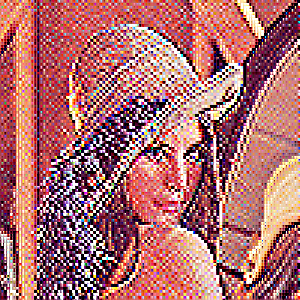

**Imagem usando bilinear, k = 4, h = 1**

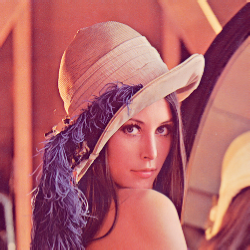

**Imagem usando bicúbica, k = 1, h = 10000**

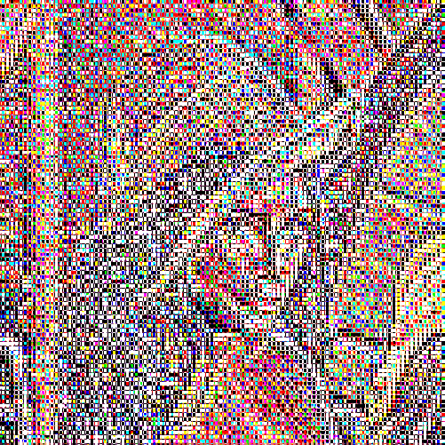

**Imagem usando bicúbica, k = 4, h = 1**

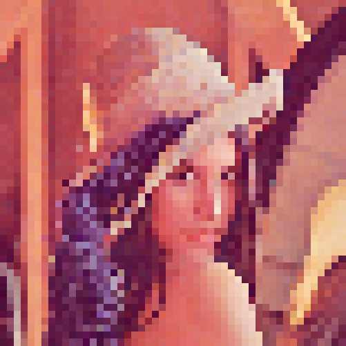

**Imagem usando bicúbica, k = 9, h = 100**

#### Quadrinho

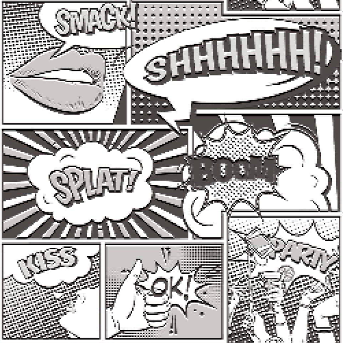

**Imagem usando bilinear, k = 1, h = 1**

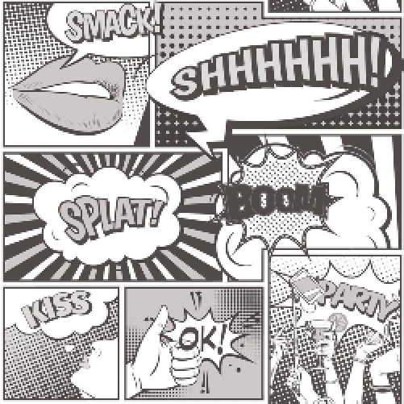

**Imagem usando bilinear, k = 1, h = 1000**

**Imagem usando bicúbica, k = 1, h = 10000**

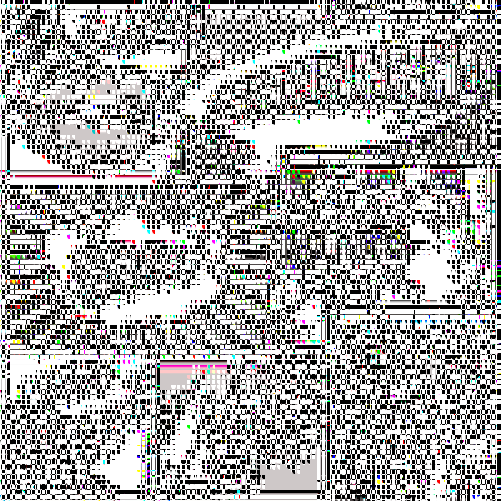

**Imagem usando bicúbica, k = 4, h = 1**

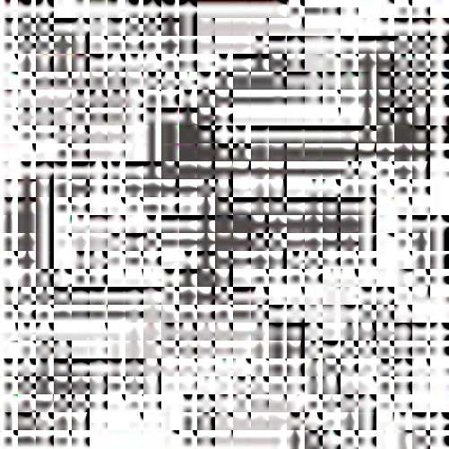

**Imagem usando bicúbica, k = 19, h = 10**

### Zoo1

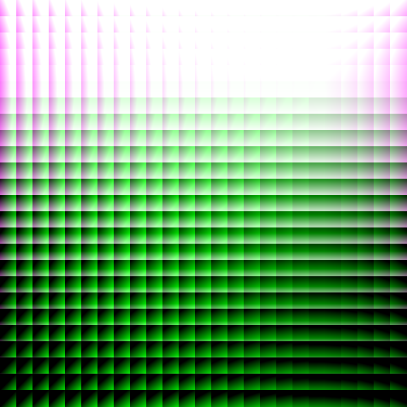

**Imagem usando bilinear, k = 19, h = 1**

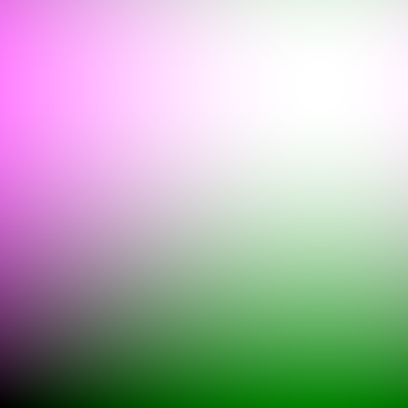

**Imagem usando bicúbica, k = 1, h = 10000**

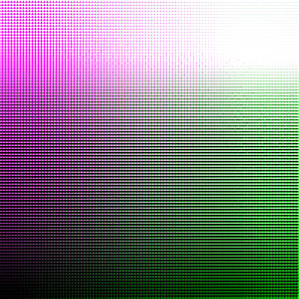

**Imagem usando bicúbica, k = 4, h = 1**

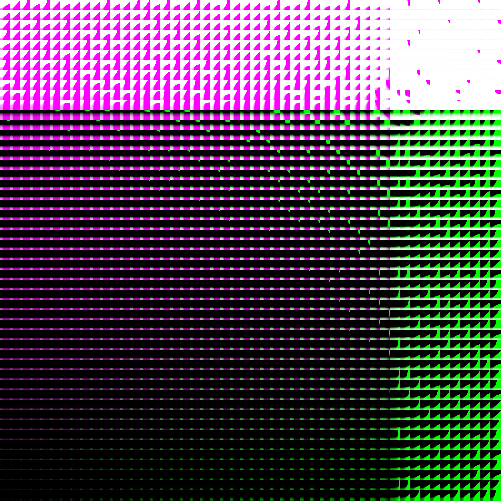

**Imagem usando bicúbica, k = 4, h = 1**

### Zoo2

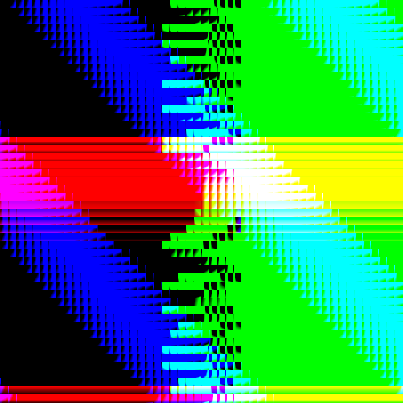

**Imagem usando bilinear, k = 9, h = 1**

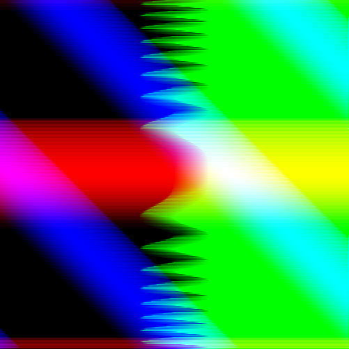

**Imagem usando bicúbica, k = 1, h = 1**

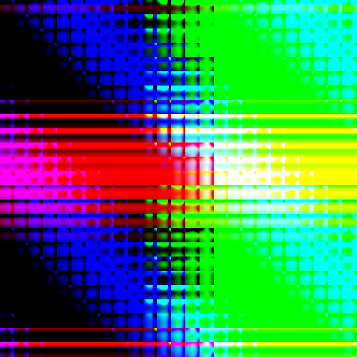

**Imagem usando bicúbica, k = 19, h = 10**

### Zoo3

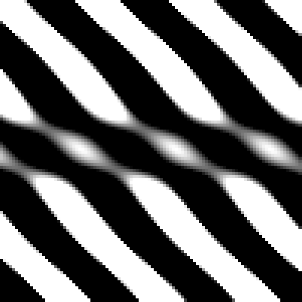

**Imagem usando bilinear, k = 4, h = 10000**

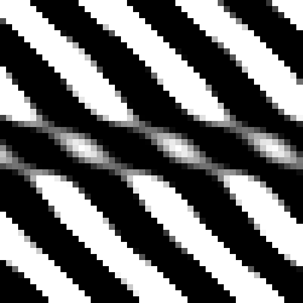

**Imagem usando bilinear, k = 9, h = 10000**

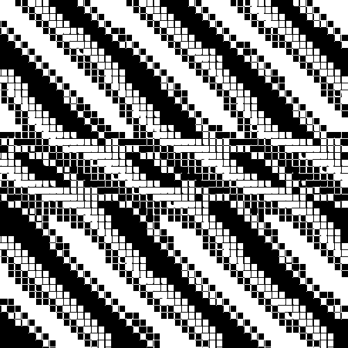

**Imagem usando bicúbica, k = 9, h = 1**

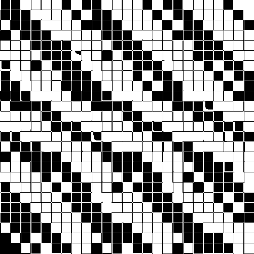

**Imagem usando bicúbica, k = 19, h = 1**

### Zoo5

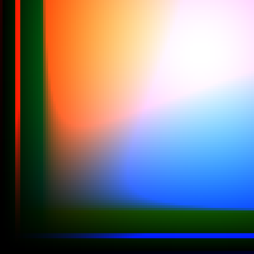

**Imagem usando bilinear, k = 4, h = 10000**

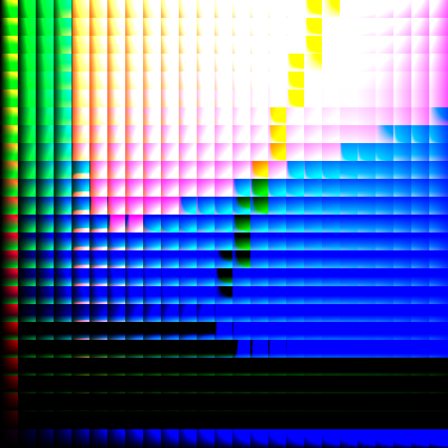

**Imagem usando bilinear, k = 19, h = 1**

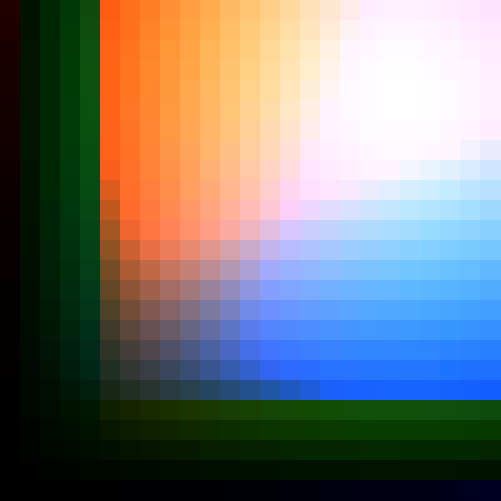

**Imagem usando bilinear, k = 19, h = 10000**

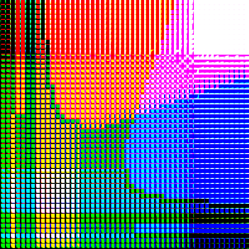

**Imagem usando bicúbica, k = 9, h = 1**